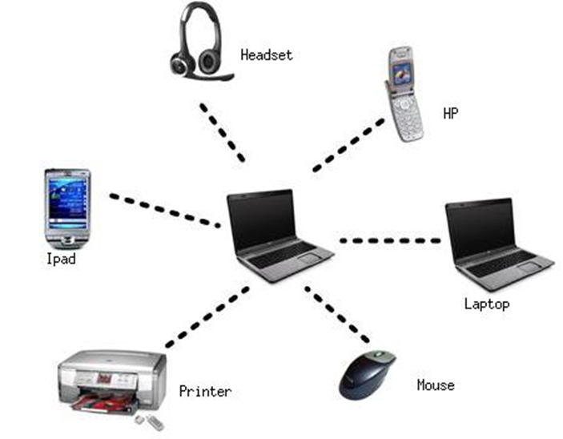

# Chapter 1 — Introduction to Networking

Halo, sebenarnya ini adalah dokumentasi pembelajaran saya pribadi, dan kenapa saya menulis ini. dikarenakan saya memiliki batas untuk mengingat. Maka dari itu saya menulisnya

Bagi kalian yang membaca ini dan menjadi sebuah pengetahuan baru, saya sangat senang!!!

_____________________________________________________________________

Dalam hal penyapaian dan penggunaan bahasa, saya buat menggunakan bahasa sehari2 agar mudah di pahami bagi siapa pun yang membaca dokumentasi pembelajaran ini..

Dengan kata lain saya menyebut ini E-book Documentation

E-book ini juga akan selalu update untuk BAB-BAB selanjutnya..
ketika saya mendapatkan pengetahuan baru BABnya akan terus bertambah.

ditulis pada tanggal:
07 November 2025.
E-book Documentation v1.0

_____________________________________________________________________

# 🌐 Chapter 1 — Introduction to Networking  
### “connections everywhere .”

---

  <strong>What is Networking</strong> — by Escape-Esc | Version 1.0 | 2025

YOU HAVE TO UNDERSTAND NETWORK
kamu harus paham jaringan!!!!

## What is a Network?

Jaringan hanyalah hal-hal yang terhubung. Jaringan dapat ditemukan dalam semua aspek kehidupan, yaitu:
- Berkomunikasi     - Kabel yang saling menghubungkan lampu
anggap saja anda sedang mengobrol dengan tetangga, teman atau orang lain.
(kata kunci jaringan adalah TERHUBUNG).

Dalam komputasi juga sama, hanya saja diterapkan pada perangkat teknologi. Contoh:
- Ponsel yang anda miliki.
lalu bagaimana perangkat-perangkat itu berkomunikasi??

Jaringan (NETWORK) dapat dibentuk oleh mulai dari 2 hingga miliaran perangkat. Perangkat ini mencangkup segalanya
- Ponsel    - Kamera
- Laptop    - Lampu
- All in the world
Jaringan menjadi hal yang wajib di pahami bagi cyber scurity

dibawah ini adalah visualisai dari bagaimana jaringan terbentuk

Selamat anda baru saja memahami bagaimana jaringan terbentuk
"Sesuatu yang saling terhubung, entah itu cinta, saudara, pernikahan, dsb. Memiliki sebuah koneksi menjadi dasar terbentuknya jaringan"

"Network are not just about connection each other, but network also have feedback loops that connet each other"
